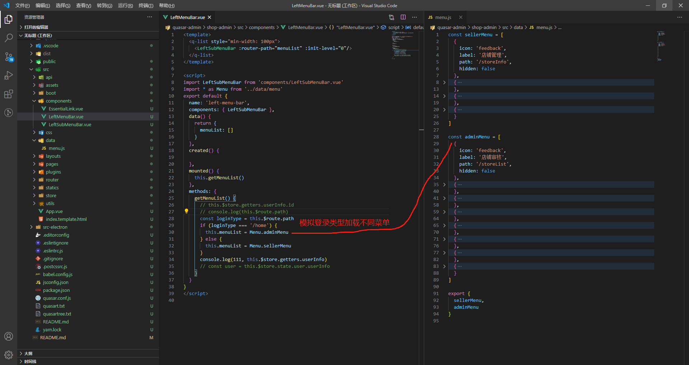
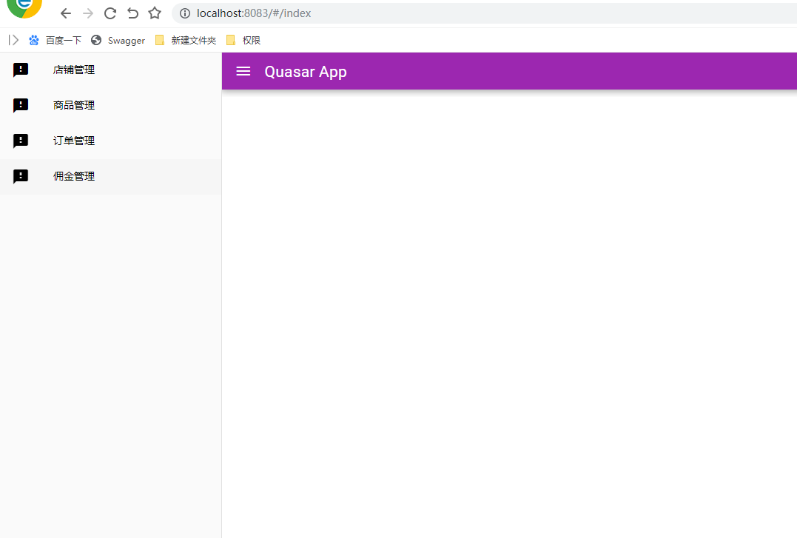
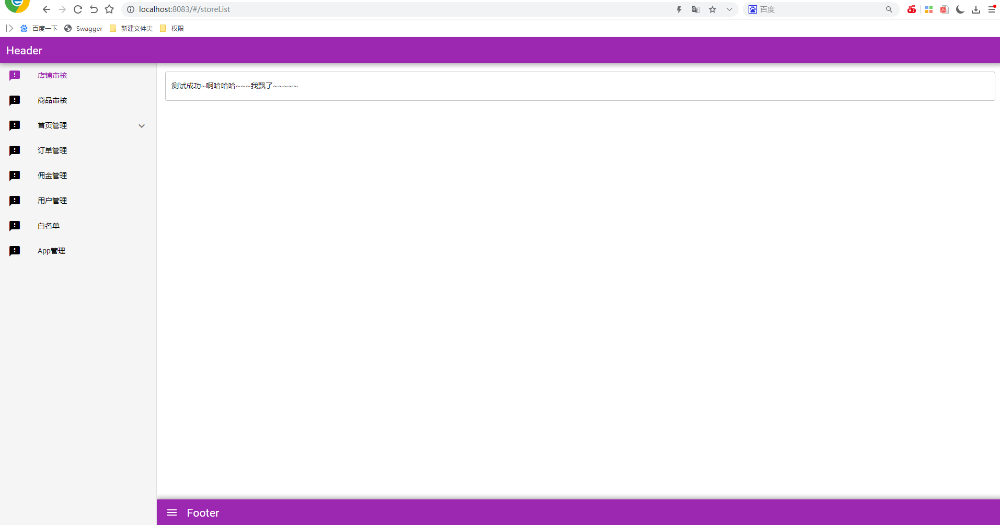

[quasar官网](https://quasar.dev/quasar-cli/installation)

## quasar-admin
### 运行本项目
```shell
# 安装
$ npm install
# or
$ yarn install

# 运行
quasar dev

# 打包
quasar build
```

### 项目介绍
使用quasar搭建的后台管理系统
```shell
# 角色菜单权限：登录成功后，根据用户信息，获取菜单
# 按钮权限控制：返回权限，指令控制
# 菜单数据结构
[
  {
    icon: 'feedback',
    label: '店铺管理',
    path: '/storeInfo',
    btns: ['btn-add','btn-delete']   # 按钮权限 与下面模拟信息不一致 思路一样
  }
]

```
### 开发代码片段说明
```shell
看了官方文档 推荐使用yarn 
so do it
ready ~~

# Node.js >=10 is required.

# 全局安装 yarn
npm install -g yarn

# 全局安装quasar  请看最底下注意事项
yarn global add @quasar/cli


# 项目启动执行文件
quasar.config.js
boot: [
	// 要执行的文件  boot文件夹中的文件名
  'axios',
  'permission'
]

build: {
	port: 8083,   // 下面8083端口
    env: {
            API: ctx.dev
              ? 'http://localhost:8080/backend'				// 后缀 与下面代理一致
              : 'http://www.xxxxx.cn/'
          },
}
devServer: {
    proxy: {
            '/backend': {
              target: 'http://testapi',
              changeOrigin: true,
              pathRewrite: {
                '^/backend': '/'
              }
            }
          },
}


```

```js
// boot文件夹
axios.js    // 请求设置
import Vue from 'vue'
import axios from 'axios'
import * as authService from '../utils/auth'
import { Loading } from 'quasar'

// Add a request interceptor process.env.API '/backend'
const axiosInstance = axios.create({
  baseURL: process.env.API,
  timeout: 10000,
  withCredentials: true
})

axiosInstance.defaults.headers.post['Content-Type'] = 'application/json;charset=UTF-8'
// 请求拦截
axiosInstance.interceptors.request.use(
  config => {
    Loading.show({
      // spinner: QSpinnerGears,
      delay: 500, // ms
      message: 'Some message',
      messageColor: 'blue',
      spinnerSize: 250, // 像素
      spinnerColor: 'white',
      customClass: 'bg-primary'
    })
    console.log('info request token:' + authService.getToken())
    if (authService.getToken()) {
      config.headers.Authorization = 'Bearer ' + authService.getToken()
    } else {
      config.headers.Authorization = ''
    }
    return config
  },
  error => {
    return Promise.reject(error)
  }
)

// 响应拦截
axiosInstance.interceptors.response.use(
  response => {
    Loading.hide()
    return response.data
  },
  error => {
    return Promise.reject(error)
  }
)

Vue.prototype.$axios = axiosInstance

export { axiosInstance }

permission.js     // 按钮权限控制
export default ({ app, router, store, Vue }) => {
  Vue.directive('permission', {
    bind: function (el, binding, vnode) {
      // localStorage.setItem('isAdmin', 0)
      // localStorage.setItem('permission', ['function_edit', 'function_add'])
      // console.log(localStorage.permission, el, binding, vnode)
      const needPermissions = binding.value
      const permissions = JSON.parse(localStorage.getItem('permission'))
      // const permissions = ['function_edit', 'function_add']
      const isAdmin = localStorage.getItem('isAdmin')
      const hasPermission = permissions.some(s => {
        return needPermissions.indexOf(s) > -1
      })
      console.log(hasPermission, isAdmin)
      if (!hasPermission) {
        el.style.display = 'none'
      }
    }
  })
}

// 按钮使用控制
<q-btn v-permission="['function_edit']" small round push glossy dense icon="edit" color="primary" @click="editFunction(props.value)"></q-btn>
<q-btn v-permission="['function_del']" small round push glossy dense icon="delete" color="red" @click="delFunction(props.value)"></q-btn>
```
```shell 
LeftMenuBar.vue     # 模拟菜单权限控制 
```


### 文件目录说明

```tree
├─.quasar
├─.vscode
├─dist
│  ├─electron
│  │  └─UnPackaged
│  └─spa
│      ├─css
│      ├─fonts
│      ├─icons
│      └─js
├─public
│  └─icons
├─src
│  ├─api
│  │  └─user
│  ├─assets
│  ├─boot
│  │  └─axios       // 请求设置
│  │  └─permission    // 指令控制按钮
│  ├─components
│  │  └─LeftMenuBar       // 左侧菜单
│  │  └─LeftSubMenuBar    // 递归子菜单
│  ├─css
│  ├─data     
│  │  └─menu      // 模拟菜单数据  
│  ├─layouts      // 布局
│  │  └─Admin       // 管理员
│  │  └─Seller    // 商家
│  ├─pages
│  │  ├─admin     // 管理员页面
│  │  │  ├─commissionManagement
│  │  │  ├─goodsManagement
│  │  │  ├─orderManagement
│  │  │  └─storeManagement
│  │  │      └─component
│  │  ├─other
│  │  └─seller    // 商家页面
│  │      ├─commissionManagement
│  │      ├─goodsManagement
│  │      ├─orderManagement
│  │      └─storeManagement
│  │          └─component
│  ├─plugins
│  ├─router
│  │  └─index      // 
│  │  └─routes    // 路由菜单配置
│  ├─store
│  │  └─modules
│  └─utils
└─src-electron
    ├─icons
    └─main-process

```


### 运行效果
​1.  假设输入地址 'localhost:8083' 模拟了登录成功进入商家页面



2.  假设输入地址 'localhost:8083/#/admin' 模拟了登录成功进入管理员页面




```js
/* 注意事项 */
1.yarn 安装 quasar ,如果 quasar命令无效，配置环境变量
2. yarn global bin   查看yarn安装路径  // C:\Users\dell\AppData\Local\Yarn\bin

// export PATH="$(yarn global bin):$PATH"		// 配置yarn 配置环境变量
3. vim ~/.bashrc  执行命令打开文件 输入4
4. export PATH="$(C:\Users\dell\AppData\Local\Yarn\bin):$PATH"

// 配置环境变量后不生效 电脑重启

// 版本问题 先移除安装
https://quasar.dev/start/upgrade-guide
出现Missing .babelrc file...的问题，导致无法运行
yarn global add @quasar/cli


```

```js
token
https://www.yht7.com/news/115473

menu
https://quasar.dev/vue-components/expansion-item#QExpansionItem-API
http://www.quasarchs.com/vue-components/menu/
https://blog.csdn.net/qq_41912398/article/details/108601413
``` 